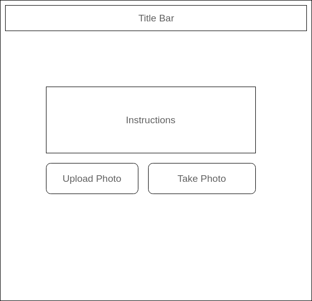

# Swift Tailor

## Background

Fitting clothes is hard. measuring yourself is awkward. Swift Tailor aims to change that! Using computer vision software, this web-app will generate basic clothing measurements from user-submitted photos. It will then display a scaled sewing pattern using these measurements. As a proof of concept, we will create a T shirt model, using the measurements of arm width, torso width, and torso height.
Applications of this tool include DIY fashion as well as integration with a clothing manufacturer for custom fitted clothes.

## MVP Features

- [ ] train up a model to detect body parts
- [ ] allow users to upload or take photos
- [ ] measure detected body parts using trackingJS
- [ ] generate and display shirt pattern as downloadable image

## Wireframes

## Technologies & Technical Challenges
  - React Frontend
  - Rails Backend
  - AWS hosting
  - OpenCV
  - Machine Learning
  - Haar cascade classifiers
  - trackingJS

  The Primary technical challenges will be:
  - Learn about image processing and teach the the app to recognize features at real time. This will be accomplished with a conjunction of technologies.  First we'll employ machine learning to build precompiled datasets (Haar classifiers) for the app to use.  Next, these classifiers will need to be converted to integrate with the trackingJS library.
  -  The next challenge will be to use the library to visualize the feature dimensions. These dimensions will be used to create the shirt patterns that will be animated.

## Group Members and Work Breakdown
StonyTech is Tony Wang and Sam Faber-Manning.

To be divided:
  - building react components
  - Adequate styling

Tony's primary responsibilities:
  - Creating dimensions for the upper body based on image processing.  This includes but not limited to searching for existing libraries and creating new libraries.
  - Integrating image processing with trackingJS to calculate arm length, torso length and torso width.

Sam's primary responsibilities:
  - Writing a script to modify a shirt template based on measurements
  - Animate the final components of the garment for the user.

## Accomplished over the weekend
  - Tony and Sam researched different computer vision libraries, including: Mathworkds/Matlab, Sobel (image boundary detection), JSfeat and finally Tracking.js.
  - We were able run and test Tracking.js library components locally.
  - Tony began work on training a model to recognize arms and integrating the models with the Tracking.js library.
  - Sam researched T shirt templates and began exploring methods of dynamically generating vector graphics.

## Implementation Timeline

**Day 1**: Setup React front end. Deploy a basic 'hello world' app to AWS.
  - Continue developing generating vector graphics (Sam)
  - Continue creating datasets for image detection (Tony)

**Day 2**: Create the layout of the website with some basic styling.
  - Add image upload Features (Sam)
  - Add the Tracking.js library for face detection.  Face detection is natively available. (Tony)
  - Continue developing generating vector graphics (Sam)
  - Continue creating datasets for image detection (Tony)

**Day 3**: Have a fully functioning site.  Users should be able to upload an image, and have measurements and a t-shirt template returned to them.
  - Continue developing generating vector graphics (Sam)
  - Continue creating datasets for image detection (Tony)

**Day 4**: Improve accuracy of user measurements.  All detection algorithms and vector graphic implementation should be completed.
  - Spend any additional time on styling the page.

**Day 5**: Styling and putting in finishing touches.
  - Write production readme
  - Catchup day for anything that still needs to be completed.

**Bonuses**:
  - User authorization, Facebook/Google Login.
  - Adding other clothing like jackets and hoodies as templates.
  - Webcam integration for taking measurements.
