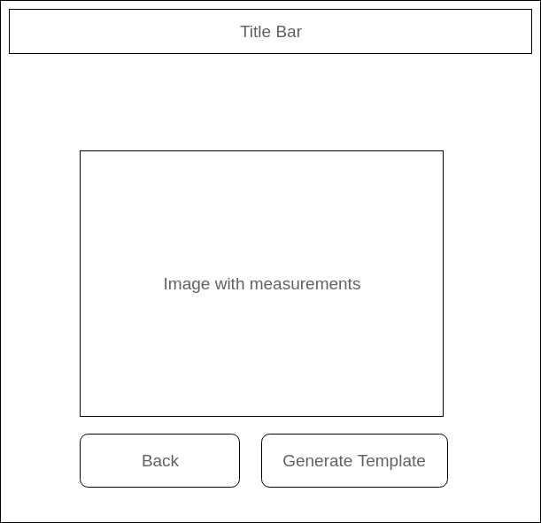

# Swift Tailor

## Background

Fitting clothes is hard. measuring yourself is awkward. Swift Tailor aims to change that! Using computer vision software, this web-app will generate basic clothing measurements from user-submitted photos. It will then display a scaled sewing pattern using these measurements. As a proof of concept, we will create a T shirt model, using the measurements of arm width, torso width, and torso height.
Applications of this tool include DIY fashion as well as integration with a clothing manufacturer for custom fitted clothes.

## MVP Features

- [ ] train up a model to detect body parts
- [ ] allow users to upload or take photos
- [ ] measure detected body parts using trackingJS
- [ ] generate and display shirt pattern as downloadable image

## Wireframes

## Technologies

  - openCV
  - trackingJS

## Group Members and Work Breakdown
StonyTech is Tony Wang and Sam Faber-Manning.

To be divided ?
  - building react components
  - writing backend for user authentication?
  -

Tony's primary responsibilities:
  - Teaching a robot to love

Sam's primary responsibilities:
  - Writing a script to modify a shirt template based on measurements

## Accomplished over the weekend
  - Tony and Sam researched different computer vision libraries, and experimented with TrackingJS.
  - Tony began work on training a model to recognize arms.
  - Sam researched T shirt templates and began exploring methods of dynamically generating vector graphics.

## Implementation Timeline

**Day 1**:

**Day 2**:

**Day 3**:

**Day 4**:

**Day 5**:
